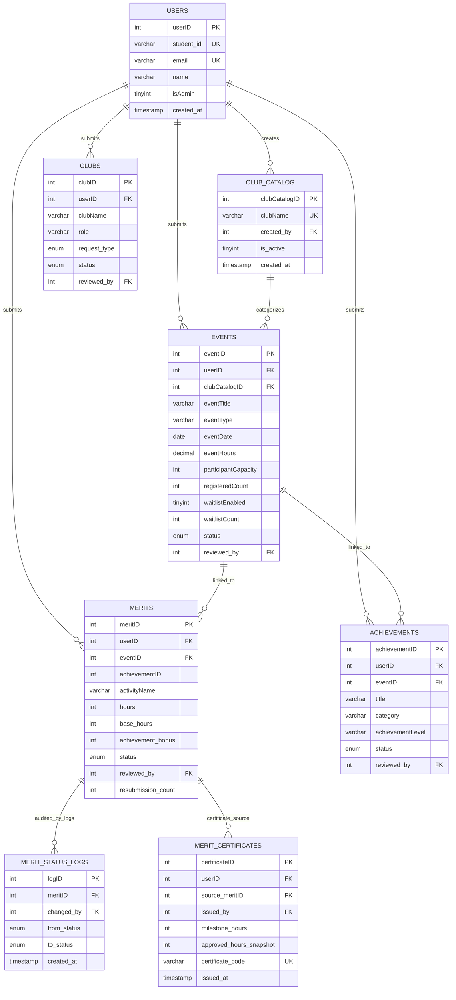

# COCU System ERD (Latest - Clean View)

This ERD is based on the live `cocu_db` schema as of 2026-04-17.

## Secondary FK Links (kept out of main diagram for readability)

- `achievements.reviewed_by -> users.userID`
- `clubs.reviewed_by -> users.userID`
- `events.reviewed_by -> users.userID`
- `merits.reviewed_by -> users.userID`
- `merit_status_logs.changed_by -> users.userID`
- `merit_certificates.issued_by -> users.userID`

## Schema Note

- `merits.achievementID` exists in the live DB, but currently has no FK constraint to `achievements.achievementID`.
